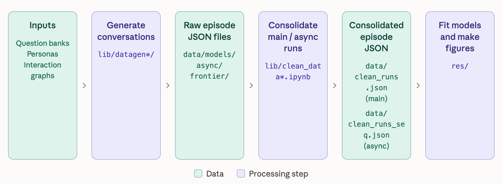

# Implementation Details

Each experiment gives a group of agents a question, a persona for each agent, and a network describing who communicates with whom. The agents express opinions, exchange messages, and update their opinions. The analysis then asks whether simple mathematical rules can predict those updates.

### Concepts

| Term | Definition and notation in the paper | Codebase name and location |
| --- | --- | --- |
| Agent | A language model conditioned on a persona or expertise profile ($p_i$), prompted to sample a message or an opinion about a question ($q$). | *In the codebase, agent `i` is represented by `personas[i]`* |
| Social tie | $J_{ij} \in \{-1,0,+1\}$, the edge between agents $i$ and $j$. For concordant (friendly) ties $(J_{ij}=+1)$ the receiver $i$ is prompted to regard the source $j$ as an agent it tends to agree with. For discordant (unfriendly) ties $(J_{ij}=-1)$ the receiver $i$ is prompted to regard the source $j$ as an agent it tends to disagree with. | *In the codebase, `rep.J[i, j]` is interpreted by [`_build_inboxes`](lib/datagen/dynamics.py#L84) as sender `i` to receiver `j`. This is equivalent to the manuscript's receiver-first indexing since networks are symmetric.* |
| Communication Network | $J \in \{-1,0,+1\}^{N \times N}$ is the collection of social ties between $N$ agents. We also define $J^{+}$ with $J^{+}_{ij}=\max(J_{ij},0)$ and $J^{-}$ with $J^{-}_{ij}=\min(J_{ij},0)$. | *In the codebase, the matrix is `J` or the episode batch `J_e`. [graph.py](lib/datagen/graph.py) constructs it; [`drives`](res/utils.py#L208) uses `np.maximum(J_e, 0)` and `np.minimum(J_e, 0)` for the positive and negative parts.* |
| Group & Community | A collection of $N$ agents connected by the signed communication network $J$. Group and community are used interchangeably. We set $N=32$. | *In the codebase, a group's configuration is carried by a [`Replica`](lib/datagen/dynamics.py#L20); its size is `rep.n` or `--num-agents`. The main analysis uses `N_AGENTS=32` in [res/utils.py](res/utils.py). The frontier variant uses 64 agents.e* |
| Opinions | A binary vote from agent $i$ at round $t$ is denoted as $o_i(t) \in \{-1,+1\}$. We take $K$ opinion samples for $o_i(t)$ and denote the $k$-th binary vote from agent $i$ at round $t$ as $o_{i,k}(t)$. We define opinion $\bar{o}_i(t)=\frac{1}{K}\sum_k o_{i,k}(t)$, and state $s_i(t)=\operatorname{sign}(\bar{o}_i(t))$. We use $K=5$ in our experiments unless stated otherwise. | *In the codebase, `spins_raw_history[t][i][k]` stores a vote, [`opinions(run)[t, i]`](res/utils.py#L53) gives its sample mean, and `spins_history[t][i]` stores the aggregated state. Generation uses `k` / `--k` for manuscript $K$. Failed samples are stored as `0`; [`_aggregate_spin`](lib/datagen/dynamics.py#L54) uses the first sample to break ties.* |
| Group Opinion | $\bar{o}(t)=(\bar{o}_1(t),\dots,\bar{o}_N(t)) \in [-1,+1]^N$ is $\bar{o}_i(t)$ from all agents at time $t$. | *In the codebase, this is [`opinions(run)[t, :]`](res/utils.py#L53), the vector of sample-mean opinions at one round.* |
| Group State | $s(t)=(s_1(t),\dots,s_N(t))$ is $s_i(t)$ from all agents at time $t$. | *In the codebase, this is `spins_history[t]` in [`Replica`](lib/datagen/dynamics.py#L20), or `ep["spins"][episode, t, :]` after [`build_episodes`](res/utils.py#L93).* |
| Individual Trajectory | $(\bar{o}_i(0),\dots,\bar{o}_i(T)) \in [-1,+1]^{T+1}$ is $\bar{o}_i(t)$ from a single agent across timesteps. We use $T=8$ in our experiments unless stated otherwise. | *In the codebase, this is [`opinions(run)[:, i]`](res/utils.py#L53). The round count is `num_steps` in [`run_forward_dynamics`](lib/datagen/dynamics.py#L240); the initial state adds one saved time point.* |
| Group Trajectory | $((\bar{o}_1(0),\dots,\bar{o}_1(T)),\dots,(\bar{o}_N(0),\dots,\bar{o}_N(T))) \in [-1,+1]^{N \times (T+1)}$ is $\bar{o}_i(t)$ from all agents across timesteps. | *In the codebase, [`opinions(run)`](res/utils.py#L53) has shape `(T+1, N)`, with time first. Its transpose has the manuscript's `(N, T+1)` layout. `spins_history` instead stores the corresponding aggregated-state trajectory.* |
| Episode | We call multiple independent runs of a group trajectory episodes. We take $4$ episodes of the same group trajectory in our experiments unless stated otherwise. | *In the codebase, each [`Replica`](lib/datagen/dynamics.py#L20) is one realization, saved as one JSON file by [`_save_replica`](lib/datagen/dynamics.py#L218). `--trajectories` and `build_replicas` in [collect_energy.py](lib/datagen/collect_energy.py) control repeated runs of the same question–graph configuration. Their realized trajectories can differ.* |
| Archetype | A discrete descriptive category assigned to an individual or a group trajectory. | *In the codebase, [`individual_archetypes`](res/utils.py#L266) and [`group_archetypes`](res/utils.py#L272) return class indices into `IND_CLASSES` and `GRP_CLASSES`; [1_archetypes.ipynb](res/1_archetypes.ipynb) uses them for descriptive analysis.* |
| Net opinion | $n(t)=\frac{1}{N}\sum_i \bar{o}_i(t)$, the average opinion of the group. | *In the codebase, `r["n"] = op.mean(axis=1)` in [2_conviction.ipynb](res/2_conviction.ipynb), with `op = opinions(r)`. Other descriptive notebooks use `r["net"]`. In the fitted-model temperature sweep, `n = s.mean(axis=1)` averages simulated binary states.* |
| Conviction | $c(t)=\frac{1}{N}\sum_i \bar{o}_i(t)^2$, the average strength of individual opinions regardless of direction. | *In the codebase, `r["mag"]["sq"] = (op ** 2).mean(axis=1)` in [2_conviction.ipynb](res/2_conviction.ipynb). The alternative `r["mag"]["abs"]` uses mean absolute opinion.* |
| Characteristic Regime | A discrete descriptive category assigned to a group opinion. One of indifference, polarization, or consensus, determined from net opinion and conviction. It is defined relative to other group opinions obtained by running the same model on the same set of questions and social graphs. | *In the codebase, `ph` and `r["ph"][cv]` store `I`, `P`, or `C` in [2_conviction.ipynb](res/2_conviction.ipynb), using `mag_cut` and `n_cut` within each model/question-regime subset. This differs from `mode` or `REGIMES`, which identify subjective/objective questions.* |
| Intrinsic field | Agent $i$'s question-specific predisposition is denoted as $g_i$. | *In the codebase, the intrinsic contribution in fitted-logit units is `h = phi @ w[:16]` in [`discrete_rollout`](res/utils.py#L217), or `h = phi @ w_field` in [5_temperaturesweep.ipynb](res/5_temperaturesweep.ipynb). [`static_field`](res/utils.py#L86) builds the feature vector `phi`, not the scalar field. No separate variable named `g_i` is stored.* |
| Local field | The combined social and intrinsic field on agent $i$ is denoted as $f_i$. | *In the codebase, no separate `f_i` variable is stored. [`discrete_rollout`](res/utils.py#L217) combines intrinsic and social contributions as `u = h + drives(J_e, s, k) @ w[16:]`, directly in logit units. A separate normalization relating manuscript $f_i$ to $h_i$ is not represented by a named variable.* |
| Logit | The complete argument passed to the logistic function in the fitted update rule, which is denoted as $h_i$. | *In the codebase, the complete discrete-update logit is `u` in [`discrete_rollout`](res/utils.py#L217). In [5_temperaturesweep.ipynb](res/5_temperaturesweep.ipynb), `u = (h + K @ s) / T` in per-episode matrix notation, so it already includes temperature scaling. Code `h` names only the intrinsic contribution, unlike manuscript $h_i$.* |
| Interaction Parameters & Couplings | We refer to $\beta$s that scale social influence in the fitted update rule as interaction parameters or couplings. | *In the codebase, these are the fitted weights `w[16:]` and named entries under `betas` in [couplings.json](res/couplings.json). `BETA_LABELS` in [4_prediction.ipynb](res/4_prediction.ipynb) defines `beta`, `beta_pos`, `beta_neg`, `beta_0`, and the truth-conditioned variants.* |
| Temperature | $\mathcal{T}$, the noise level of the fitted update rule. We reintroduce it in rollouts by scaling the logit, $P(s_i(t+1)=+1)=\sigma(h_i(t)/\mathcal{T})$, so higher $\mathcal{T}$ makes updates noisier. The fitted rule corresponds to the operating point $\mathcal{T}=1$. | *In the codebase, this is argument `T` of `sweep_at` and values in `T_GRID` in [5_temperaturesweep.ipynb](res/5_temperaturesweep.ipynb). Here `T` means temperature, not the round count. The generation CLI's `--temperature` instead controls language-model sampling temperature, which we fix at 0.7 for all our experiments.* |
| Variance of Absolute Net Opinion | $\chi=N\,\mathrm{Var}_t(\lvert n(t)\rvert)$, the variance of the absolute net opinion over a rollout, scaled by the number of agents. | *In the codebase, `variance_abs_net_opinion` computes `N_AGENTS * (net_sq_mean - net_abs_mean ** 2)` in [5_temperaturesweep.ipynb](res/5_temperaturesweep.ipynb). `sweep_at` computes it per chain over the post-burn-in window; `chi_soc` averages replica values for each community.* |
| Critical Temperature | $\mathcal{T}_c$, the temperature at which $\chi$ peaks for a community. It marks the finite-size analogue of the phase transition between the high conviction characteristic regimes (consensus, polarization) and the low conviction one (indifference). | *In the codebase, `refine_peak` estimates each community's peak in [5_temperaturesweep.ipynb](res/5_temperaturesweep.ipynb). `tc_by_society` stores these temperatures, and the result entry `tc` is their mean.* |

Here, `n` is the number of agents and `T` is the number of update rounds. The main runs use `n = 32`, `T = 8`, and `k = 5`, giving **nine recorded opinion states**: the initial state plus eight updates. These are experiment settings, not universal array sizes.

## 1. Repository layout and data flow

```
lib/                    experiment generation (Python package + consolidation notebooks)
  datagen/              core synchronous dynamics (main experiments)
  datagen_async/        schedule-driven fully asynchronous dynamics
  datagen_frontier/     mixed frontier-model dynamics (OpenRouter)
  features.py           shared embedding / PCA feature loaders
  clean_data.ipynb      raw per-episode JSON -> data/clean_runs.json
  clean_data_seq.ipynb  raw async JSON      -> data/clean_runs_seq.json
data/                   question banks, personas, raw episodes, consolidated runs
  lowrank/              additional graph-family episodes and construction README
res/                    analysis notebooks (figures and prediction tables)
  utils.py              shared analysis library (loading, features, fits, metrics)
online_appendix/        static browser for the message-level data
```



The pipeline has three processing stages:

1. **Generation.** The command-line entry points in `lib/datagen*/collect_*.py` build a bank of agent societies (a persona list, a question, and an interaction graph J), advance each society through the opinion dynamics by repeatedly calling a language model, and write one raw JSON file per episode under `data/models/`, `data/async/`, or `data/frontier/`, together with a `manifest.json` recording the full configuration.
2. **Consolidation.** The notebooks `lib/clean_data.ipynb` and `lib/clean_data_seq.ipynb` flatten the raw episode files into the two flat records files `data/clean_runs.json` (synchronous runs, 9,600 episodes) and `data/clean_runs_seq.json` (asynchronous runs, 480 episodes), attaching the ground-truth answer (objective questions) or political-lean label (subjective questions) to every episode.
3. **Analysis.** The numbered notebooks in `res/` use the shared library `res/utils.py` to produce descriptive figures and prediction tables. Most read the consolidated files; the frontier notebook reads `data/frontier/` directly, and the generalization notebook combines the main consolidated runs with episode files from `data/lowrank/`. These additional datasets do not need a consolidation step. Notebook `4_prediction.ipynb` additionally writes the fitted coupling constants to `res/couplings.json`, which the downstream notebooks `5_temperaturesweep.ipynb` and `6_distribution.ipynb` read back.

Generation writes the experiment data; analysis reads it. The generation code does not need fitted results from `res/`.

### A three-agent example

Consider a subjective statement and three agents, numbered 0, 1, and 2:

```text
J = [[ 0, +1, -1],
     [+1,  0,  0],
     [-1,  0,  0]]
```

Agents 0 and 1 receive each other's messages as sources they tend to agree with. Agents 0 and 2 receive each other's messages as sources they tend to disagree with. Agents 1 and 2 have no direct connection. The sign describes the relationship between agents, not whether a message says AGREE or DISAGREE.

One round works as follows:

1. Start from the current opinions, for example `[+1, -1, +1]`. At step 0 these were sampled with empty inboxes.
2. Ask each sender to write a message consistent with its current opinion. Agent 0's same message goes to both agents 1 and 2.
3. Build the new inboxes. Agent 0 gets agent 1's message in its “tends to agree with” section and agent 2's in its “tends to disagree with” section.
4. Ask each agent for its opinion again, using its new inbox. With `k = 5`, samples `[+1, +1, -1, +1, -1]` produce an aggregated opinion of `+1`.
5. Save both the five samples and the aggregated opinion, then repeat for the next round.

These values illustrate the mechanics. They are not results from a recorded experiment. The functions implementing this sequence are described in Section 2.4.

## 2. Experiment generation: `lib/`

### 2.1 The language-model abstraction

The dynamics code calls `response = pi(prompt)`. It does not need to know which service produced the response. The callable's type, `Pi`, is defined in [samplers.py](lib/datagen/samplers.py).

Functions in [utils.py](lib/datagen/utils.py) construct this callable for different backends:

- `make_openai_pi` wraps the OpenAI chat-completions API (or any OpenAI-compatible endpoint via `base_url`) with exponential-backoff retries; the sampling temperature (0.7 by default) and output-token cap are fixed at construction.
- `make_together_pi` reuses `make_openai_pi` against Together's OpenAI-compatible endpoint (used for the Llama, Qwen, and Gemma runs).
- `make_mock_pi` is a deterministic offline stand-in (hash-based A/B or AGREE/DISAGREE answers and a canned message) used for smoke-testing the full pipeline without API access; the collection CLIs expose it via `--mock`.

The frontier experiments add a fourth factory, `make_openrouter_pi` in [openrouter.py](lib/datagen_frontier/openrouter.py), again delegating to `make_openai_pi` with OpenRouter's base URL. It also maps the `--reasoning` flag onto OpenRouter's unified reasoning parameter; the collection CLI defaults to `none` to request direct judgments.

Because all backends reduce to the same `Pi` signature, the dynamics code is entirely backend-agnostic.

### 2.2 Prompts and spin sampling: `lib/datagen/samplers.py`

[samplers.py](lib/datagen/samplers.py) implements the two elementary LM operations of the model, in two regimes:

- `spin_sampler` elicits a binary opinion ("spin"). In the **subjective** regime the agent is prompted with its persona, its current inbox, and the statement, and must answer with exactly one word, AGREE (+1) or DISAGREE (−1). In the **objective** regime the persona describes an expertise, the statement is a two-option (A/B) problem, and the response A maps to +1, B to −1. The objective instruction requests a direct, single-character judgment without reasoning. The code comments describe this as a way to limit latency and cost and encourage snap judgments.
- `message_sampler` elicits the two-sentence message an agent broadcasts to its neighbors, conditioned on the same context plus the agent's current spin (an undecided spin of 0 is broken uniformly at random for the message's stance). The message states the agent's stance and its strongest reason.

Both prompts present the inbox split into two sections — messages from sources the agent *tends to agree with* and *tends to disagree with*. This is how the sign of the interaction matrix J enters the dynamics: the split is performed at the receiver from the sign of J (Section 2.3), so the samplers themselves never see J. Response parsing differs by regime:

- `_parse_spin_subjective` looks for DISAGREE first, then AGREE, within the response text. It is more permissive than the requested one-word format.
- `_parse_spin_objective` accepts A or B, including longer text containing only one of those standalone answer labels. It raises exception if both labels appear or neither appears.

The dynamics layer retries parse failures twice. A persistent failure becomes spin `0`; the synchronous spin phase also records other failed calls as `0`. If an agent has spin `0` when asked to write a message, its message stance is chosen randomly from `−1` and `+1`. Failed samples and zero-valued aggregated states are rare: they account for 0.0377% of raw samples (5,214/13,824,000) and 0.00192% of aggregated states (53/2,764,800), respectively.

### 2.3 Interaction graphs: `lib/datagen/graph.py`

[graph.py](lib/datagen/graph.py) constructs an `n × n` matrix `J`:

| `J[i, j]` | What receiver `j` sees from sender `i` |
| --- | --- |
| `+1` | A message in the “sources you tend to agree with” section. |
| `−1` | A message in the “sources you tend to disagree with” section. |
| `0` | No message from this sender. |

The constructors produce symmetric graphs: `J[i, j] = J[j, i]`. Diagonal entries are zero, so agents do not send messages to themselves.

The generation module provides two constructors:

- `sample_J_num_edges_symmetric` draws a symmetric random graph with a prescribed number of non-zero entries: each upper-triangular pair receives U_ij ~ Uniform(−1, 1), the largest-|U| pairs are kept, and each kept edge takes the sign of its U (so positive "agree" and negative "disagree" bonds are equally likely).
- `make_lattice_J` builds two regular graph benchmarks: a square grid with up to four neighbors per agent and a triangular grid with up to six (the square grid plus a down-left diagonal), with a uniform bond sign. Boundaries have fewer neighbors; the grids do not wrap around.

The `num_edges` argument counts **non-zero matrix entries**, so each undirected connection counts twice. For example, 112 entries represent 56 undirected connections; with 32 agents, the average degree is `112 / 32 = 3.5`. The additional low-rank matrices are stored in the episodes under `data/lowrank/`. See [the low-rank README](data/lowrank/README.md) for the construction description and metrics.

### 2.4 Synchronous forward dynamics: `lib/datagen/dynamics.py`

[dynamics.py](lib/datagen/dynamics.py) is the main part of the generation code. A `Replica` is a (statement, J) pair run. `run_forward_dynamics` advances a list of replicas together through `num_steps` synchronous rounds:

**Initialization:** `_run_spin_phase(..., use_inbox=False)` samples all agents with empty inboxes to obtain `s(0)`.

**Each update round:**

| Order | Function | What it does |
| --- | --- | --- |
| 1 | `_run_message_phase` | Requests one message per sender with outgoing connections, using its previous opinion and inbox. Broadcasts that message to its recipients. |
| 2 | `_build_inboxes` | Groups incoming messages by the sign of `J` and shuffles their order using a seed derived from replica name, step, and receiver. Called within the message phase. |
| 3 | `_run_spin_phase` | Requests `k` opinion samples per agent using the new inbox, then saves the samples and their majority vote. |

`_aggregate_spin` takes the sign of the sum of the samples. If the sum is zero, it uses the first sample; an empty sample list produces `0`. The calls within each phase run concurrently in a shared `ThreadPoolExecutor`. **Every message is collected before any new opinion is sampled for the next turn.** This ordering is what “synchronous” means here. `_save_replica` writes one `<name>.json` file containing the experiment context and histories. See the field reference in Section 3 for their shapes and time indices. An earlier version sampled multiple messages per sender. The comment above `_run_message_phase` records this change, and legacy runs remain in the data.

### 2.5 `lib/datagen/collect_energy.py`

Run the following from the repository root to generate subjective-question trajectories with GPT-4o-mini using the main-experiment settings. Set OPENAI_API_KEY in your environment first.

```bash
python -m lib.datagen.collect_energy \
  --model gpt-4o-mini \
  --mode subjective \
  --num-agents 32 \
  --num-edges 112 \
  --num-train-graphs 8 \
  --num-seen-graphs 4 \
  --num-fresh-graphs 4 \
  --trajectories 4 \
  --num-steps 8 \
  --k 5 \
  --seed 0 \
  --output-dir outputs/gpt-4o-mini/subjective_energy
```

Square and triangular lattices are included by default. The command writes a manifest.json and one JSON file per episode to the specified output directory. API-backed generation incurs usage charges.

For objective questions, change --mode subjective to --mode objective and use a corresponding output directory. For an offline run with simulated responses, add --mock.

### 2.6 Asynchronous dynamics: `lib/datagen_async/`

In an asynchronous run, agents update individually according to a saved schedule. Different agents can therefore have different amounts of recent information.

The implementation separates schedule creation from execution:

1. **Create the schedule** with [make_schedule.py](lib/datagen_async/make_schedule.py), using `python -m lib.datagen_async.make_schedule`. It makes no API calls. Each timestep has 1,000 fine cells; an agent fires in each cell with probability `p_step / 1000`. With `p_step = 0.5`, an agent fires 0.5 times per timestep on average. Same-cell events are randomly ordered.
2. **Rebuild the experiment** with [collect_energy_seq.py](lib/datagen_async/collect_energy_seq.py), using `python -m lib.datagen_async.collect_energy_seq`. `build_replicas_from_schedule` uses the schedule metadata to reconstruct the question map and graph bank, then creates a `SeqReplica` for each scheduled episode.
3. **Replay the events** with [dynamics_seq.py](lib/datagen_async/dynamics_seq.py). After the initial opinion samples, `_advance_replica_chain` processes one episode's events in order.

At each event, the firing agent first posts a message based on its latest opinion, then resamples its opinion from the current message board. The board retains the latest message on each edge, including messages from agents that have not fired recently.

Events within one episode remain sequential. Different episodes run concurrently, and their LM calls use a shared thread pool. A failed episode chain is not saved, and chain failures cause the run to raise an error.

Schedules are stored at `data/async/schedules/<mode>_firing_schedule.json`. Using the same graph seed and parameters as the synchronous experiment reproduces its random graph bank; asynchronous schedules exclude lattices.

`SeqReplica` extends `Replica` with the schedule and event histories. The module reuses `_aggregate_spin`, `_build_inboxes`, `_run_spin_phase`, `_spin_call_with_retry`, and the prompt samplers from the synchronous implementation. Saved records retain the common history fields and add event-level information.

### 2.7 Frontier mixed-model dynamics: `lib/datagen_frontier/`

The frontier experiment tests the fitted update rules on societies mixing two frontier model families. [collect_frontier.py](lib/datagen_frontier/collect_frontier.py) (`python -m lib.datagen_frontier.collect_frontier`) runs n = 64 agents — 32 on each of two models (by default GPT-5.6-sol and DeepSeek-V4-Flash via OpenRouter) — on one fixed random graph J0 (224 non-zero matrix entries, or 112 undirected connections, preserving average degree 3.5), for 8 steps with k = 1 spin sample, one episode per question, over the pooled train + test questions of both regimes. With the block assignment, the 32-persona bank is tiled over the 64 agents, so agents i and i + 32 share a persona across the two families. The round order and prompt protocol follow `lib.datagen.collect_energy`; the agent count, model assignment, graph selection, and sampling settings differ.

[dynamics_mixed.py](lib/datagen_frontier/dynamics_mixed.py) makes this possible with a minimal extension: `MixedReplica` adds a per-agent model list, and the message/spin phases are copies of the synchronous ones in which every LM call is routed to the `Pi` of the acting agent's model (`_pi_for` on a dict of per-model `Pi`s built by `make_openrouter_pis`). The saved JSON additionally records `agent_models`. Outputs go to `data/frontier/<modelA>__<modelB>/<mode>_energy/`.

### 2.8 Consolidation and shared features

- [clean_data.ipynb](lib/clean_data.ipynb) gathers every episode JSON under `data/models/*/*/`, normalizes it into a flat table, parses the `<question>__<graph>__rep<r>` naming into columns, joins the ground-truth answers (from the objective banks' `answer` field) and political-lean labels (from `data/subj/lean.json`), asserts that every episode received exactly one of the two labels, and writes `data/clean_runs.json` (also pushed to the Hugging Face Hub as `physics-of-agents/agent-opinions`). [clean_data_seq.ipynb](lib/clean_data_seq.ipynb) does the same for `data/async/` into `data/clean_runs_seq.json`.
- [features.py](lib/features.py) is a small shared feature layer: a numpy-SVD `PCAReducer` (no sklearn dependency) and loaders for the persona and question embedding files, used when preparing the precomputed `embedding_pca10` features stored in the question banks.

## 3. Data: `data/`

### 3.1 Reading one saved episode

The synchronous episode JSON mirrors the `Replica` object. Arrays are stored as nested JSON lists.

| Field | Meaning / shape |
| --- | --- |
| `meta` | Run metadata, including the episode name and agent count. |
| `personas` | One persona string per agent; list order defines agent indices. |
| `statement`, `mode`, `choices` | The question, regime, and A/B options when applicable. |
| `J` | Interaction matrix, shape `(n, n)`. |
| `spins_history` | Aggregated opinions, shape `(T + 1, n)`. Index 0 is the initial state. |
| `spins_raw_history` | Individual opinion samples, shape `(T + 1, n, k)`. |
| `messages_history` | `T` dictionaries. Entry 0 contains the messages used to produce opinion state 1. JSON keys such as `"0,2"` mean sender 0 → receiver 2. |

For a main run, `spins_raw_history[2][7][3]` is agent 7's fourth sample at step 2. `spins_history[2][7]` is that agent's aggregated opinion at the same step. Indices are zero-based.

Keep the two opinion representations distinct: prediction uses aggregated spins, while `opinions(run)` averages the raw samples for descriptive analysis. The five samples `[+1, +1, -1, +1, -1]` yield an aggregated spin of `+1` but a mean opinion of `0.2`.

### 3.2 Input and output files

Inputs prepared before generation:

- `data/subj/` and `data/obj/` — the subjective and objective question banks. `train.jsonl` / `test.jsonl` carry, per question, the qid, text, split, the A/B choices and correct `answer` (objective), pilot-response statistics, and the precomputed 10-component PCA embedding `embedding_pca10`. `personas.json` is the canonical 32-persona bank per regime; `persona_embeddings.json` and `question_embeddings*.json` hold the raw text embeddings; `subj/lean.json` maps each subjective qid to a left/right/ambiguous lean.
- `data/async/schedules/` — the pre-sampled firing schedules (Section 2.6).

Stored datasets and outputs:

- `data/models/<model>/<mode>_energy/` — raw synchronous episodes, one JSON per replica plus `manifest.json` (4 models × 2 regimes).
- `data/async/gpt-4o-mini/<mode>_energy_seq/` — raw asynchronous episodes.
- `data/frontier/<modelA>__<modelB>/<mode>_energy/` — raw frontier mixed-model episodes.
- `data/lowrank/gpt-4o-mini/ood_lowrank/<mode>_rank_frustration/` — 240 additional episodes across both regimes, each with its own `J` and spin histories. Each regime has six graphs × ten test questions × two replicas. The manifests include entries for trajectories absent from the release; the generalization notebook loads existing episode files and uses the question banks to verify their test split. Objective coverage is ten of the twenty test questions. [README.md](data/lowrank/README.md) describes these graphs.
- `data/clean_runs.json`, `data/clean_runs_seq.json` — the consolidated records used by the analysis: one row per episode with model, regime, statement, J, spin histories, replica index, and the ground-truth / lean label.
- `data/J_matrices.json` (and `data/async/J_matrices.json`) — the communication networks in exportable form.

## 4. Analysis: `res/`

The analysis helper functions live in [res/utils.py](res/utils.py).

### 4.1 Load trajectories and build features

`load_data` reads consolidated runs, question banks, and persona embeddings. Embeddings are numeric representations of text; PCA reduces them to a few coordinates used as prediction features. Questions use their first three stored PCA components, and `pca3` computes three persona components per regime.

`graph_classes` labels graphs as seen, train-only, fresh, or lattice from their structure and the question splits in which they occur. `opinions` returns the mean of the raw spin samples, with shape `(T + 1, n)` for one episode.

`static_field` constructs features that stay fixed throughout an episode:

| Feature block | Number of columns | Meaning |
| --- | --- | --- |
| Bias | 1 | A constant feature for the baseline tendency toward `+1`. |
| Persona, `p` | 3 | The agent's persona coordinates. |
| Question, `q` | 3 | The question's coordinates, repeated for each agent. |
| Persona–question products, `p ⊗ q` | 9 | Every persona coordinate multiplied by every question coordinate. |
| **Total** | **16** | The static feature block. |

`build_episodes` groups one model × regime into aligned arrays. `build_xy` then pairs each previous opinion with its next opinion:

- `x` has shape `(episodes, T, n, 19)`: one previous spin, 16 static features, and two peer drives.
- `y` has shape `(episodes, T, n)`: the next aggregated spin. Unparsed targets (`0`) are excluded from fitting and scoring.

The positive drive is `J⁺s`, with `J⁺ = max(J, 0)`. The negative drive is `J⁻s`, with `J⁻ = min(J, 0)`, so its weights retain their negative signs. The analysis uses matrix–vector products and the generated graphs are symmetric.

### 4.2 Fit an update rule and run it forward

`Logistic` fits a logistic regression: it maps the features to a probability of the next spin being `+1`. Its implementation standardizes feature columns and uses full-batch `adam` to optimize cross-entropy with a small L2 penalty (`10⁻³`) on the persona/question field weights. The bias and coupling coefficients are unpenalized. Couplings start at `0.1`.

`fit_continuous` in the synchronous and asynchronous prediction notebooks fits the original feature columns without centering or scaling. Its L2 penalty (`10⁻³`) applies to the non-bias field coefficients in these original coordinates. Couplings start at `0.1` and are unpenalized. All other optimization parameters start at zero, including `θ₀`, so the initial update rate is `ε = sigmoid(0) = 0.5`. The sigmoid keeps the fitted update rate in `(0, 1)`.

`two_stage_fit` handles designs whose peer drives are linearly dependent.  In particular, the unsigned drive satisfies `|J|s = J⁺s − J⁻s`. It first fits the unsigned coupling `β₀`, then keeps that contribution fixed while fitting the signed couplings. For a two-stage continuous fit, the first stage's unsigned coefficient supplies a fixed additive score in the second stage. 

There are two ways to evaluate an update rule:

| Evaluation | Where the previous opinions come from |
| --- | --- |
| One-step prediction | Predict the next state given the current correct state (current state is always assumed to be correct state, even when predicting multiple steps ahead) |
| Rollout | Predict the next state given the current predicted state (errors can accumulate since the next step prediction is conditioned on predicted values of the current step in predictions for multi-step ahead) |

### 4.3 Score predictions and describe behavior

`raw_acc` is the percentage of correct predictions among transitions with parsed targets.

`fcba` is *flip-and-class balanced accuracy*. It computes accuracy separately for four groups, then averages the nonempty groups equally:

| Transition | Next opinion |
| --- | --- |
| Flip | `+1` |
| Flip | `−1` |
| Stay | `+1` |
| Stay | `−1` |

This keeps frequent “stay” events from dominating the score. Both previous and next spins must be nonzero. When all four groups are present, always retaining the previous spin or always predicting one label scores 50%.

### 4.4 Find the notebook for a question

Execution Dependency: `4_prediction.ipynb` writes `res/couplings.json`. Run that notebook before `5_temperaturesweep.ipynb` or `6_distribution.ipynb` if the fitted file is absent or needs regenerating. `4_prediction_generalization.ipynb` fits its own models and can run independently.

- [1_archetypes.ipynb](res/1_archetypes.ipynb) — the individual and group trajectory archetypes and their composition tables across models and regimes.
- [2_conviction.ipynb](res/2_conviction.ipynb) — the net opinion vs. conviction over rounds and the consensus / polariztion / indifference decomposition.
- [3_truth_seeking.ipynb](res/3_truth_seeking.ipynb) — objective questions: does the net opinion's sign converge to the correct answer over the 9 rounds. [3S_politicallean.ipynb](res/3S_politicallean.ipynb) and [3S_labelbias.ipynb](res/3S_labelbias.ipynb) analyze political lean and answer-label bias. The objective bank has balanced answer labels.
- [4_prediction.ipynb](res/4_prediction.ipynb) — the main prediction table: the update rules (persistence, interaction-free, mean-field, the discrete update, and its three-coupling extension) fit on train questions × the eight random graphs and scored on test questions × seen vs. fresh graphs, under both metrics, one-step and rollout. It ends by refitting the discrete update at one / three / five couplings and *writing `res/couplings.json`*, the interface to the two notebooks below.
- [4_prediction_generalization.ipynb](res/4_prediction_generalization.ipynb) — fits the five discrete methods once per GPT-4o-mini question regime on training questions × eight random graphs, then evaluates held-out questions on four fresh random graphs, six low-rank graphs, and the square and triangular lattices. It reads low-rank episodes directly from `data/lowrank/` and reports coverage before scoring. Its 80 scores (five methods × two regimes × four graph families × one-step/rollout) use flip-and-class balanced accuracy. 
- [4_prediction_frontier.ipynb](res/4_prediction_frontier.ipynb) — the prediction methods on the frontier mixed-family run (read directly from `data/frontier/`): n = 64, one graph, personas tiled, k = 1; with a single J.
- [5_temperaturesweep.ipynb](res/5_temperaturesweep.ipynb) — reads `couplings.json`, varies the temperature of the fitted three-coupling update to study changes in collective behavior. Here, temperature controls the randomness of the fitted model, rather than the API sampling temperature. The notebook locates the variance_abs_net_opinion peak separately for each question–graph group, then reports the mean of those group peak temperatures. It also plots the mean variance_abs_net_opinion curve and its standard deviation across groups.
- [6_distribution.ipynb](res/6_distribution.ipynb) — reads `couplings.json` and asks whether free-running the fitted update from the real s(0) reproduces the distribution of individual and group archetypes of the real runs, plus the replica predictability ceiling.
- [7_prediction_continuous.ipynb](res/7_prediction_continuous.ipynb) — the continuous-time extension `m(t+1) = (1−ε)s(t) + ε·tanh(w·design)`. It is fit by penalized maximum likelihood on the original feature columns with the shared Adam optimizer and added to the prediction tables.
- [8_prediction_async.ipynb](res/8_prediction_async.ipynb) — the continuous-time methods refit on the schedule-driven asynchronous runs (`data/clean_runs_seq.json`).